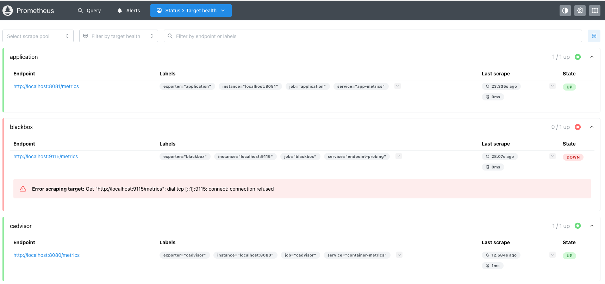
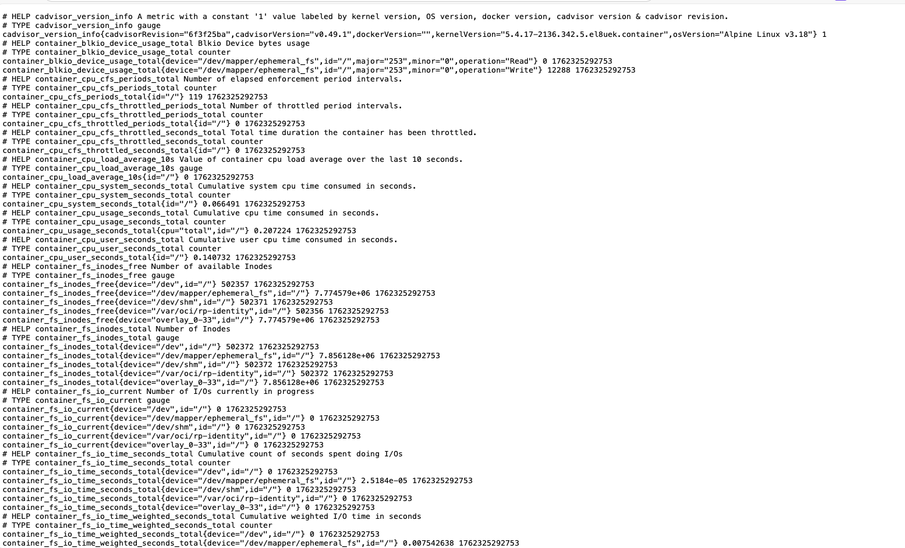

# OCI Container Instance Monitoring Demo

Production-ready monitoring solution for OCI Container Instances with sidecar-based Prometheus metrics collection, log forwarding, and automatic Management Agent registration.

## 🎯 Overview

This demo provides comprehensive container monitoring using a modern sidecar architecture:

- **📊 Sidecar-Based Monitoring**: Management Agent, Prometheus, and Log Forwarder run as sidecar containers
- **🔄 Automatic Registration**: Management Agent auto-registers with your OCI tenancy
- **📝 Log Forwarding**: Automatic log collection and forwarding to OCI Logging
- **🔒 Network Security**: NSG with automatic IP detection for secure access
- **📦 One-Command Deployment**: Fully automated infrastructure provisioning
- **🐳 Multi-Exporter Support**: cAdvisor, Node Exporter, and application-specific exporters

## 🏗️ Sidecar Architecture (7 Containers)

```
┌──────────────────────────────────────────────────────────────────────────┐
│              OCI Container Instance - 7 Containers                       │
│              Public IP: YOURIP                                           │
│                                                                          │
│  ┌─────────────────┐  ┌──────────────────┐  ┌──────────────────┐      │
│  │  Application    │  │  Official Oracle │  │  Prometheus      │      │
│  │  Container      │  │  Mgmt Agent      │  │  Sidecar         │      │
│  │  + cAdvisor     │  │  Sidecar v1.9.0  │  │                  │      │
│  │  + Node Export. │  │                  │  │  - Aggregates    │      │
│  │                 │  │  - Auto-registers│◄─┤    all metrics   │      │
│  │  - App :80      │  │  - ConfigFile    │  │  - Scrapes :9090 │      │
│  │  - Metrics :9090│◄─┤    with input.rsp│  │  - Prometheus DB │      │
│  │  - cAdvisor:8080│  │  - Resource      │  └──────────────────┘      │
│  │  - Node Exp:9100│  │    Principal     │                            │
│  └────────┬────────┘  │  - Sends to OCI  │  ┌──────────────────┐      │
│           │           │    Monitoring    │  │  Grafana         │      │
│           │           └──────────────────┘  │  Sidecar         │      │
│           │                                 │                  │      │
│           │           ┌──────────────────┐  │  - Dashboards    │      │
│           │           │  Log Forwarder   │  │  - Prometheus DS │      │
│           └──────────►│  Sidecar         │  │  - Port :3000    │      │
│      Writes logs      │                  │  │  - admin/admin   │      │
│      to /logs         │  - Monitors /logs│◄─┼──Queries────────│      │
│                       │  - Batch forward │  │    Prometheus    │      │
│                       │  - OCI Logging   │  └──────────────────┘      │
│                       └──────────────────┘                            │
│                                                                          │
│  Shared Volumes:                                                         │
│  • /metrics  - Shared for metrics exchange                              │
│  • /logs     - Shared for log collection                                │
└──────────────────────────────────────────────────────────────────────────┘
                              ↓
                    ┌─────────┴─────────┐
                    │                   │
              ┌─────▼──────┐    ┌──────▼───────┐
              │OCI          │    │OCI           │
              │Monitoring   │    │Logging       │
              │             │    │              │
              │Namespace:   │    │Log Group:    │
              │container_   │    │container-    │
              │monitoring   │    │instance-logs │
              └─────────────┘    └──────────────┘
```

## 📸 Screenshots & Component Integration

This section demonstrates the complete monitoring stack in action, showing how all 7 containers work together to provide comprehensive observability.

> **Note:** Screenshot image files should be placed in the `/screenshots/` directory. See `/screenshots/README.md` for required files and naming conventions.

> **Important:** Throughout this documentation, `YOURIP` is used as a placeholder for your Container Instance's public IP address. Replace it with your actual deployment IP when accessing the services.

### 1. Grafana Metrics Explorer

Grafana provides a powerful visualization interface for all collected metrics. The screenshot below shows the Metrics Explorer with container-level metrics:


**What you see:**
- Real-time container CPU and memory usage
- Network I/O metrics for all containers
- Custom application metrics from the application container
- Historical data visualizations with configurable time ranges
- Prometheus datasource pre-configured and connected

**Access:** `http://YOURIP:3000` (Username: `admin`, Password: `admin`)

### 2. Application Monitoring Stack Overview

The main application webpage provides a comprehensive overview of the monitoring architecture:


**What you see:**
- Visual representation of the 7-container sidecar architecture
- Component health status indicators
- Links to access each monitoring component directly
- System information and deployment details
- Real-time health check status

**Access:** `http://YOURIP/`

### 3. Prometheus Target Health

Prometheus continuously scrapes metrics from all configured exporters. This view shows the health status of all scrape targets:



**What you see:**
- **cAdvisor** (localhost:8080) - Container metrics - Status: UP
- **Node Exporter** (localhost:9100) - Host system metrics - Status: UP
- **Application Metrics** (localhost:9090) - Custom app metrics - Status: UP
- Last scrape time and duration for each target
- Error indicators if any target is down

**Access:** `http://YOURIP:9090/targets`

### 4. cAdvisor Detailed Metrics

cAdvisor provides detailed container-level metrics in Prometheus format. This shows the raw metrics output:



**What you see:**
- `container_cpu_usage_seconds_total` - CPU usage per container
- `container_memory_usage_bytes` - Current memory usage
- `container_network_receive_bytes_total` - Network ingress
- `container_network_transmit_bytes_total` - Network egress
- `container_fs_reads_bytes_total` - Filesystem read operations
- Labels for container identification (name, id, image)

**Access:** `http://YOURIP:8080/metrics`

### Component Integration Flow

```
┌─────────────────────────────────────────────────────────────────────┐
│                    Complete Metrics & Logs Flow                     │
└─────────────────────────────────────────────────────────────────────┘

1. APPLICATION CONTAINER
   ├─ Generates custom application metrics
   ├─ Writes logs to /logs/application.log
   └─ Exposes health check endpoint

2. cAdVISOR (Port 8080)
   ├─ Monitors all 7 containers in the instance
   ├─ Collects CPU, memory, network, filesystem metrics
   └─ Exposes metrics at :8080/metrics

3. NODE EXPORTER (Port 9100)
   ├─ Monitors host system (container instance)
   ├─ Collects CPU, memory, disk, network interface stats
   └─ Exposes metrics at :9100/metrics

4. PROMETHEUS (Port 9090)
   ├─ Scrapes cAdvisor every 60s
   ├─ Scrapes Node Exporter every 60s
   ├─ Scrapes Application metrics every 60s
   ├─ Stores time-series data locally
   ├─ Provides query interface (PromQL)
   └─ Exposes aggregated metrics at :9090/metrics

5. GRAFANA (Port 3000)
   ├─ Connects to Prometheus as datasource
   ├─ Queries metrics using PromQL
   ├─ Visualizes data in pre-configured dashboards
   └─ Provides alerting capabilities

6. MANAGEMENT AGENT (Background)
   ├─ Scrapes Prometheus endpoint (:9090/metrics)
   ├─ Forwards metrics to OCI Monitoring service
   ├─ Sends to namespace: container_monitoring
   └─ Enables viewing metrics in OCI Console

7. LOG FORWARDER (Background)
   ├─ Monitors /logs directory for new log entries
   ├─ Reads: application.log, prometheus.log, cadvisor.log
   ├─ Batches log entries (100 per batch)
   └─ Forwards to OCI Logging using Resource Principal
```

### Verification Steps

After deployment, verify the integration:

```bash
# 1. Check all containers are ACTIVE
oci container-instances container list \
  --container-instance-id <instance-id> \
  --query 'data[*].{Name:"display-name",State:"lifecycle-state"}' \
  --output table

# 2. Test Application
curl http://YOURIP/
curl http://YOURIP/health

# 3. Test Prometheus
curl http://YOURIP:9090/-/healthy
curl http://YOURIP:9090/api/v1/targets

# 4. Test cAdvisor
curl http://YOURIP:8080/metrics | grep container_cpu

# 5. Test Node Exporter
curl http://YOURIP:9100/metrics | grep node_cpu

# 6. Access Grafana
open http://YOURIP:3000
# Login: admin/admin

# 7. Verify OCI Monitoring (metrics should appear within 2-3 minutes)
oci monitoring metric list \
  --compartment-id $COMPARTMENT_OCID \
  --namespace container_monitoring

# 8. Verify OCI Logging
oci logging-search search-logs \
  --search-query "search \"<log-group-ocid>\" | sort by datetime desc" \
  --time-start "2025-01-01T00:00:00.000Z" \
  --time-end "2025-12-31T23:59:59.999Z"
```

## ✨ Key Features

### Automated Monitoring
- ✅ **Management Agent Auto-Registration**: Automatically registers with OCI tenancy using install key
- ✅ **Sidecar-Based Collection**: No agent installation needed on host
- ✅ **Prometheus Integration**: Metrics collected via Prometheus protocol
- ✅ **OCI Monitoring**: Metrics appear in `container_monitoring` namespace
- ✅ **Real-time Collection**: 60-second default scrape interval (configurable)

### Log Management
- ✅ **Automatic Log Forwarding**: Sidecar monitors and forwards logs to OCI Logging
- ✅ **Shared Volume Pattern**: Application writes to `/logs`, forwarder reads and sends
- ✅ **Batch Processing**: Efficient batching with configurable size
- ✅ **Resource Principal Auth**: Secure, credential-less authentication

### Network Security
- ✅ **Automatic IP Detection**: NSG automatically configured with your public IP
- ✅ **Port-Based Rules**: Secure access to all monitoring ports
- ✅ **Least Privilege**: Only necessary ports exposed to your IP
- 🔒 **Private Subnet Recommended**: For production deployments, use private subnets without public IP assignment. Public IPs shown in examples are for testing only.

### Container Images in Deployment
1. **Official Oracle Management Agent** - v1.9.0 from Oracle Container Registry (no custom build needed)
2. **Prometheus Sidecar** - Custom image: Aggregates metrics from all local exporters
3. **Application Container** - Custom image: Sample nginx app with health endpoints
4. **Log Forwarder Sidecar** - Custom image: Monitors /logs and forwards to OCI Logging
5. **Grafana** - Official grafana/grafana:latest with auto-configured Prometheus datasource
6. **cAdvisor** - Official google/cadvisor:latest for container metrics
7. **Node Exporter** - Official prom/node-exporter:latest for host metrics

## 📋 Prerequisites

### Required Tools
- **Terraform** >= 1.0.0
- **OCI CLI** configured with valid credentials
- **Docker** for building container images
- **Git** for cloning repository

### OCI Resources Required
- OCI tenancy with appropriate compartment
- VCN with subnet
- OCIR (Oracle Cloud Infrastructure Registry) access
- IAM permissions for:
  - Container Instances
  - Management Agents
  - Monitoring
  - Logging
  - Networking (NSG creation)

### OCI IAM Policies

The solution automatically creates necessary IAM policies and dynamic groups. Required root-level policies:

```hcl
# Allow Container Instances to use OCI services
Allow dynamic-group <prefix>-container-instance-dg to manage all-resources in compartment <compartment>

# Allow Management Agent operations
Allow dynamic-group <prefix>-container-instance-dg to manage management-agents in compartment <compartment>
Allow dynamic-group <prefix>-container-instance-dg to use metrics in compartment <compartment>

# Allow log forwarding
Allow dynamic-group <prefix>-container-instance-dg to use log-content in compartment <compartment>
```

## 🚀 Quick Start

### 1. Clone Repository

```bash
git clone https://github.com/your-username/oci-container-monitoring-demo.git
cd oci-container-monitoring-demo
```

### 2. Configure Environment

```bash
# Copy example configuration
cp config/oci-monitoring.env.example config/oci-monitoring.env

# Edit configuration with your OCI details
vi config/oci-monitoring.env
```

**Required Configuration:**

```bash
# OCI Authentication
export OCI_REGION="eu-frankfurt-1"
export OCI_TENANCY_OCID="ocid1.tenancy.oc1..aaaa..."
export OCI_COMPARTMENT_OCID="ocid1.compartment.oc1..aaaa..."

# Networking
export VCN_OCID="ocid1.vcn.oc1..aaaa..."
export SUBNET_OCID="ocid1.subnet.oc1..aaaa..."

# OCIR Credentials (for pushing custom images)
export OCIR_USERNAME="<namespace>/<username>"
export OCIR_PASSWORD="<auth_token>"

# Container Configuration
export CONTAINER_INSTANCE_NAME="monitoring-demo"

# Sidecar Architecture (Enable all sidecars)
export ENABLE_SHARED_VOLUMES="true"
export ENABLE_MANAGEMENT_AGENT_SIDECAR="true"
export ENABLE_PROMETHEUS_SIDECAR="true"
export ENABLE_LOG_FORWARDER_SIDECAR="true"
```

### 3. Build and Push Container Images

```bash
cd docker
./build-all.sh
```

**What this does:**
- Builds 4 container images:
  1. Management Agent Sidecar
  2. Prometheus Sidecar
  3. Application with Metrics
  4. Log Forwarder Sidecar
- Pushes images to OCIR
- **Automatically updates** `config/oci-monitoring.env` with image URLs

**Output:**
```
✓ Configuration file updated successfully!

Updated image URLs:
  MGMT_AGENT_SIDECAR_IMAGE="fra.ocir.io/.../mgmt-agent-sidecar:1.0.0"
  PROMETHEUS_SIDECAR_IMAGE="fra.ocir.io/.../prometheus-sidecar:1.0.0"
  APP_WITH_METRICS_IMAGE="fra.ocir.io/.../app-with-metrics:1.0.0"
  LOG_FORWARDER_SIDECAR_IMAGE="fra.ocir.io/.../log-forwarder-sidecar:1.0.0"
```

### 4. Deploy Infrastructure

```bash
cd ..
./scripts/deploy.sh deploy
```

**Deployment includes:**
- ✅ IAM policies and dynamic groups
- ✅ Management Agent install key creation
- ✅ **NSG with automatic IP detection**
- ✅ Container Instance with all sidecars
- ✅ OCI Logging log group and logs
- ✅ Optional monitoring alarms

### 5. Verify Deployment

#### Check Management Agent Registration

```bash
# List Management Agents in your compartment
oci management-agent agent list \
  --compartment-id $OCI_COMPARTMENT_OCID \
  --lifecycle-state ACTIVE \
  --query 'data[*].{"Name":"display-name","State":"lifecycle-state","Host":"host"}' \
  --output table
```

**Expected Output:**
```
+---------------------------------+---------+---------------------------+
| Name                            | State   | Host                      |
+---------------------------------+---------+---------------------------+
| <hostname>-mgmt-agent          | ACTIVE  | monitoring-demo-app       |
+---------------------------------+---------+---------------------------+
```

#### View Metrics in OCI Console

1. Navigate to: **Observability & Management → Monitoring → Metrics Explorer**
2. Select your compartment
3. Choose namespace: **`container_monitoring`**
4. Select metrics:
   - `container_cpu_usage_seconds_total`
   - `container_memory_usage_bytes`
   - `app_requests_total` (custom metric)

#### View Logs in OCI Console

1. Navigate to: **Observability & Management → Logging → Logs**
2. Find log group: **`container-instance-logs`**
3. View logs:
   - **Application Log** - Application stdout/stderr
   - **System Log** - Container system logs

#### Check Container Status

```bash
# Get container instance details
oci container-instances container-instance get \
  --container-instance-id <instance-ocid> \
  --query 'data.{"State":"lifecycle-state","Containers":"containers[*].{Name:display-name,State:lifecycle-state}"}' \
  --output json
```

**Expected Output (7 Containers):**
```json
{
  "State": "ACTIVE",
  "Containers": [
    {
      "Name": "monitoring-demo-app",
      "State": "ACTIVE"
    },
    {
      "Name": "monitoring-demo-cadvisor",
      "State": "ACTIVE"
    },
    {
      "Name": "monitoring-demo-node-exporter",
      "State": "ACTIVE"
    },
    {
      "Name": "monitoring-demo-mgmt-agent-sidecar",
      "State": "ACTIVE"
    },
    {
      "Name": "monitoring-demo-prometheus-sidecar",
      "State": "ACTIVE"
    },
    {
      "Name": "monitoring-demo-log-forwarder-sidecar",
      "State": "ACTIVE"
    },
    {
      "Name": "monitoring-demo-grafana-sidecar",
      "State": "ACTIVE"
    }
  ]
}
```

#### Access Grafana Dashboard

Grafana is pre-configured with Prometheus datasource and provides powerful visualization capabilities.

**Access URL**: `http://YOURIP:3000`

**Default Credentials**:
- Username: `admin`
- Password: `admin`

**What to verify:**
1. Login to Grafana at `http://YOURIP:3000`
2. Navigate to **Explore** → Metrics Explorer for ad-hoc queries
3. Check **Data Sources** → Prometheus should be pre-configured pointing to `http://localhost:9090`
4. Query metrics using PromQL:
   - `container_cpu_usage_seconds_total` - Container CPU usage
   - `container_memory_usage_bytes` - Container memory usage
   - `rate(container_network_receive_bytes_total[5m])` - Network ingress rate
   - Custom application metrics from your application container
5. Create custom dashboards by importing or building from scratch

#### Access Prometheus Directly

```bash
# Prometheus web UI
curl http://YOURIP:9090

# Or open in browser
open http://YOURIP:9090

# Query API example
curl 'http://YOURIP:9090/api/v1/query?query=up'
```

#### Access Container Metrics Exporters

```bash
# cAdvisor - Container metrics (detailed container statistics)
curl http://YOURIP:8080/metrics

# Node Exporter - Host metrics (system-level stats)
curl http://YOURIP:9100/metrics

# Application metrics (custom metrics from your app)
curl http://YOURIP/metrics
```

## 📊 Complete Workflow

### Phase 1: Build Container Images (docker/build-all.sh)

```
1. Login to OCIR
2. Build Management Agent Sidecar
   └─ Oracle Management Agent v1.9.0
   └─ Configure auto-registration with Resource Principal
3. Build Prometheus Sidecar
   └─ Prometheus server with scrape configuration
   └─ Targets: cAdvisor, Node Exporter, Application
4. Build Application Container
   └─ Nginx with health check endpoints
   └─ Generates metrics for demonstration
5. Build Log Forwarder Sidecar
   └─ Python app with OCI SDK
   └─ Watches /logs directory and forwards to OCI Logging
6. Push all 4 custom images to OCIR
7. AUTO-UPDATE config/oci-monitoring.env
   └─ Updates all image URLs automatically!

Note: Grafana, cAdvisor, and Node Exporter use official public images
```

### Phase 2: Terraform Infrastructure (./scripts/deploy.sh deploy)

```
1. Initialize Terraform
2. Detect Your Public IP (automatic)
   └─ Uses https://ifconfig.me/ip
3. Create IAM Resources
   ├─ Dynamic Group for Container Instances
   ├─ Policies for Management Agent
   ├─ Policies for Monitoring
   └─ Policies for Logging
4. Create NSG with Your IP
   ├─ HTTP/HTTPS: 80, 443
   ├─ Prometheus: 9090
   ├─ cAdvisor: 8080
   ├─ Node Exporter: 9100
   └─ Optional exporters: 9104, 9113, 9115, 9121, 9187
5. Create Management Agent Install Key
6. Create Logging Resources
   ├─ Log Group
   ├─ Application Log
   └─ System Log
7. Deploy Container Instance with 7 Containers
   ├─ Application Container (nginx)
   ├─ cAdvisor (container metrics)
   ├─ Node Exporter (host metrics)
   ├─ Management Agent Sidecar (forwards to OCI)
   ├─ Prometheus Sidecar (aggregates metrics)
   ├─ Log Forwarder Sidecar (forwards logs)
   └─ Grafana (visualization)
8. Attach NSG to Container Instance
9. Configure Shared Volumes
   ├─ /metrics (Prometheus access)
   └─ /logs (Log Forwarder access)
```

### Phase 3: Container Startup & Registration

```
Application Container:
1. Starts nginx web server on port 80
2. Serves health check endpoint at /health
3. Generates sample metrics
4. Writes logs to /logs/application.log

cAdvisor Container:
1. Starts cAdvisor on port 8080
2. Monitors all 7 containers in the instance
3. Collects CPU, memory, network, filesystem metrics
4. Exposes metrics at :8080/metrics

Node Exporter Container:
1. Starts Node Exporter on port 9100
2. Monitors host system resources
3. Collects CPU, memory, disk, network interface stats
4. Exposes metrics at :9100/metrics

Prometheus Sidecar:
1. Loads prometheus.yml configuration
2. Scrapes cAdvisor (:8080/metrics) every 60s
3. Scrapes Node Exporter (:9100/metrics) every 60s
4. Scrapes Application metrics every 60s
5. Stores time-series data in local database
6. Provides query interface at :9090
7. Exposes aggregated metrics at :9090/metrics

Grafana Sidecar:
1. Starts Grafana on port 3000
2. Auto-configures Prometheus datasource (localhost:9090)
3. Installs default plugins
4. Ready for dashboard creation and metric visualization
5. Login: admin/admin

Management Agent Sidecar:
1. Downloads Management Agent RPM from OCI Object Storage
2. Extracts and installs agent using rpm2cpio
3. Creates response file with install key from environment
4. Runs setup.sh → REGISTERS WITH OCI
   ├─ Validates install key with OCI service
   ├─ Generates communication wallet
   ├─ Generates security artifacts
   └─ Registers with Management Agent service
5. Configures Prometheus plugin (prometheusPluginConfig.json)
6. Starts agent (agentcore start)
7. Begins scraping Prometheus endpoint (:9090/metrics) every 60s
8. Forwards metrics to OCI Monitoring namespace: container_monitoring

Log Forwarder Sidecar:
1. Initializes OCI Logging client with Resource Principal
2. Monitors /logs directory using file watchers
3. Watches multiple log files: application.log, prometheus.log, etc.
4. Detects new log entries in real-time
5. Batches logs (100 entries per batch)
6. Forwards batches to OCI Logging using Resource Principal
7. Continues monitoring for new logs (no polling, event-driven)
```

### Phase 4: Monitoring & Verification

```
Local Access (via Public IP: YOURIP):
1. Grafana Dashboard: http://YOURIP:3000
   ├─ Login: admin/admin
   ├─ Explore metrics using Metrics Explorer
   ├─ Create custom dashboards
   └─ Query Prometheus datasource with PromQL
2. Prometheus UI: http://YOURIP:9090
   ├─ View targets health status
   ├─ Execute PromQL queries
   └─ Graph metrics
3. cAdvisor: http://YOURIP:8080
   └─ View detailed container metrics
4. Node Exporter: http://YOURIP:9100/metrics
   └─ View host system metrics
5. Application: http://YOURIP/
   └─ Health check: http://YOURIP/health

OCI Management Agent Console:
1. Navigate to: Observability & Management → Management Agents
2. Find agent: <hostname>-mgmt-agent
3. Status: ACTIVE
4. Plugin: Prometheus (Enabled)

OCI Monitoring Console:
1. Navigate to: Observability & Management → Monitoring → Metrics Explorer
2. Namespace: container_monitoring
3. View metrics (appear within 2-3 minutes after deployment):
   ├─ container_cpu_usage_seconds_total
   ├─ container_memory_usage_bytes
   ├─ container_network_receive_bytes_total
   ├─ container_network_transmit_bytes_total
   ├─ node_cpu_seconds_total
   ├─ node_memory_MemAvailable_bytes
   └─ Custom application metrics (if configured)

OCI Logging Console:
1. Navigate to: Observability & Management → Logging → Logs
2. Log Group: container-instance-logs
3. Logs:
   ├─ Application Log (from /logs/application.log)
   └─ Additional logs (prometheus, cadvisor, etc. if configured)
```

## 🗂️ Project Structure

```
oci-container-monitoring-demo/
├── config/
│   └── oci-monitoring.env          # Main configuration (auto-updated by build-all.sh)
├── docker/
│   ├── build-all.sh                # Builds all 4 images + AUTO-UPDATES .env
│   ├── management-agent/
│   │   ├── Dockerfile
│   │   └── entrypoint.sh           # Agent registration & startup
│   ├── prometheus/
│   │   ├── Dockerfile
│   │   └── prometheus.yml
│   ├── app-with-metrics/
│   │   ├── Dockerfile
│   │   └── app.py                  # Sample app with /metrics
│   └── log-forwarder/
│       ├── Dockerfile
│       ├── log-forwarder.py        # Monitors /logs and forwards to OCI
│       └── config.json.template
├── terraform/
│   ├── main.tf                     # Main config + NSG module
│   ├── variables.tf
│   ├── outputs.tf                  # Includes detected IP & NSG info
│   └── modules/
│       ├── container-instance/     # Container Instance + sidecars
│       ├── iam/                    # Policies + dynamic groups
│       ├── logging/                # OCI Logging resources
│       ├── management-agent/       # Install key creation
│       └── nsg/                    # Network Security Group
├── scripts/
│   └── deploy.sh                   # Deployment orchestration
└── README.md                       # This file
```

## 📡 Management Agent Prometheus Data Source

The Management Agent uses the Prometheus plugin to collect metrics and forward them to OCI Monitoring. This section explains how it's configured and how metrics flow from Prometheus to OCI.

### How It Works

```
Application Metrics (:9090/metrics)
    ↓
Prometheus Sidecar (aggregates)
    ↓
Management Agent (scrapes Prometheus)
    ↓
OCI Monitoring (container_monitoring namespace)
```

### Configuration

The Management Agent Prometheus plugin is automatically configured using the **ConfigFile** volume with `input.rsp`:

```bash
# Automatically created by Terraform in ConfigFile volume
ManagementAgentInstallKey=${MGMT_AGENT_INSTALL_KEY}
AgentDisplayName=${CONTAINER_INSTANCE_NAME}-mgmt-agent
CredentialWalletPassword=${AUTO_GENERATED_PASSWORD}
Service.plugin.prometheus.download=true  # Downloads Prometheus plugin
```

### Prometheus Plugin Configuration

The plugin configuration is automatically created at agent startup:

**Location**: `/opt/oracle/mgmt_agent/agent_inst/config/prometheus/prometheusPluginConfig.json`

```json
{
  "entities": [
    {
      "namespace": "oci_prometheus_metrics",
      "metricNamespace": "container_monitoring",
      "resourceGroup": "monitoring-demo",
      "prometheusConfig": {
        "sourceUrl": "http://localhost:9090/metrics",
        "scrapeInterval": "60s",
        "scrapeTimeout": "10s"
      }
    }
  ]
}
```

### Viewing Metrics in OCI Console

**Step 1**: Navigate to OCI Monitoring
1. Go to **Observability & Management** → **Monitoring** → **Metrics Explorer**
2. Select your compartment
3. Choose namespace: **`container_monitoring`** (NOT `oci_prometheus_metrics`)

**Step 2**: Query Metrics
Available metric families:
- `container_cpu_usage_seconds_total` - CPU usage per container
- `container_memory_usage_bytes` - Memory usage per container
- `container_network_receive_bytes_total` - Network ingress
- `container_network_transmit_bytes_total` - Network egress
- `node_cpu_seconds_total` - Host CPU metrics
- `node_memory_MemAvailable_bytes` - Host memory metrics
- Custom application metrics (if exposed)

**Step 3**: Create Charts
- Use PromQL-like queries in OCI Metrics Explorer
- Set aggregation intervals (1m, 5m, 1h)
- Create alarms based on thresholds

### Verification

**Check Management Agent Status**:
```bash
# List Management Agents
oci management-agent agent list \
  --compartment-id $OCI_COMPARTMENT_OCID \
  --lifecycle-state ACTIVE \
  --query 'data[*].{"Name":"display-name","State":"lifecycle-state"}' \
  --output table
```

**Check Prometheus Plugin**:
```bash
# In Management Agent container logs, look for:
✓ Prometheus plugin configured
✓ Agent is now collecting and forwarding metrics to OCI Monitoring
```

**Verify Metrics Flow**:
```bash
# Test Prometheus endpoint
curl http://YOURIP:9090/metrics

# Test specific metric query
curl 'http://YOURIP:9090/api/v1/query?query=container_memory_usage_bytes'

# Check OCI Monitoring for recent data points (metrics appear within 2-3 minutes)
oci monitoring metric list \
  --compartment-id $OCI_COMPARTMENT_OCID \
  --namespace container_monitoring
```

### Customizing Scrape Configuration

To modify scrape intervals or add additional scrape targets, update `terraform.tfvars`:

```hcl
# Metrics Configuration
prometheus_scrape_interval  = 60   # seconds
prometheus_scrape_timeout   = 10   # seconds
metrics_namespace          = "container_monitoring"
```

Then re-apply terraform:
```bash
cd terraform
terraform apply -auto-approve
```

## 🔧 Configuration Reference

### Sidecar Architecture Variables

```bash
# Enable sidecar pattern
export ENABLE_SHARED_VOLUMES="true"

# Management Agent Sidecar
export ENABLE_MANAGEMENT_AGENT_SIDECAR="true"
export MGMT_AGENT_SIDECAR_IMAGE="fra.ocir.io/.../mgmt-agent-sidecar:1.0.0"
export MGMT_AGENT_SIDECAR_MEMORY_GB="1.0"
export MGMT_AGENT_SIDECAR_OCPUS="0.25"

# Prometheus Sidecar
export ENABLE_PROMETHEUS_SIDECAR="true"
export PROMETHEUS_SIDECAR_IMAGE="fra.ocir.io/.../prometheus-sidecar:1.0.0"
export PROMETHEUS_SIDECAR_MEMORY_GB="1.0"
export PROMETHEUS_SIDECAR_OCPUS="0.25"

# Log Forwarder Sidecar
export ENABLE_LOG_FORWARDER_SIDECAR="true"
export LOG_FORWARDER_SIDECAR_IMAGE="fra.ocir.io/.../log-forwarder-sidecar:1.0.0"
export LOG_FORWARDER_SIDECAR_MEMORY_GB="0.5"
export LOG_FORWARDER_SIDECAR_OCPUS="0.125"
```

### Prometheus Exporter Configuration

```bash
# Base exporters (always recommended)
export ENABLE_PROMETHEUS_EXPORTERS="true"  # cAdvisor + Node Exporter

# Application-specific exporters (optional)
export ENABLE_NGINX_EXPORTER="false"      # Nginx metrics
export ENABLE_REDIS_EXPORTER="false"      # Redis metrics
export ENABLE_POSTGRES_EXPORTER="false"   # PostgreSQL metrics
export ENABLE_MYSQL_EXPORTER="false"      # MySQL metrics
export ENABLE_BLACKBOX_EXPORTER="false"   # Endpoint probing
```

### Metrics Configuration

```bash
export PROMETHEUS_SCRAPE_INTERVAL="60"    # Seconds between scrapes
export PROMETHEUS_SCRAPE_TIMEOUT="10"     # Scrape timeout
export PROMETHEUS_METRICS_PORT="9090"     # Metrics endpoint port
export PROMETHEUS_METRICS_PATH="/metrics" # Metrics endpoint path
export METRICS_NAMESPACE="container_monitoring"  # OCI Monitoring namespace
```

### Logging Configuration

```bash
export ENABLE_LOGGING="true"              # Enable OCI Logging
export LOG_GROUP_NAME="container-instance-logs"
export LOG_RETENTION_DAYS="30"
export ENABLE_AUDIT_LOGS="true"
```

## 🔍 Troubleshooting

### Management Agent Not Registered

**Check container logs:**
```bash
oci container-instances container list \
  --container-instance-id <instance-id> \
  --query 'data[?contains("display-name", `mgmt-agent`)].id' \
  --raw-output | head -1 | xargs -I {} \
  oci container-instances container retrieve-logs \
  --container-id {}
```

**Common issues:**
1. **Install key expired** - Create new install key
2. **IAM policies missing** - Verify dynamic group and policies
3. **Network connectivity** - Check NSG and subnet route tables
4. **Agent already registered** - Agent persists in volume, container restart uses existing registration

### No Metrics in OCI Monitoring

**Verify Management Agent status:**
```bash
# In Management Agent sidecar container logs, look for:
✓ Management Agent registered successfully with OCI
✓ Management Agent started successfully
✓ Agent is now collecting and forwarding metrics
```

**Check Prometheus endpoint:**
```bash
# From within container instance:
curl http://localhost:9090/metrics
```

**Verify namespace:**
- Metrics appear in namespace: `container_monitoring`
- NOT in `oci_prometheus_metrics` (that's the plugin namespace)

### Logs Not Appearing in OCI Logging

**Check Log Forwarder status:**
```bash
# View log forwarder container logs
oci container-instances container list \
  --container-instance-id <instance-id> \
  --query 'data[?contains("display-name", `log-forwarder`)].id' \
  --raw-output | head -1 | xargs -I {} \
  oci container-instances container retrieve-logs \
  --container-id {}
```

**Verify log OCID:**
```bash
# Check that LOG_OCID environment variable is set in log forwarder
# It should match the application_log_ocid from logging module
```

### NSG Blocking Access

**Check your current IP:**
```bash
curl https://ifconfig.me/ip
```

**Verify NSG rules:**
```bash
oci network nsg-security-rule list \
  --network-security-group-id <nsg-id> \
  --query 'data[*].{"Direction":"direction","Source":"source","Port":"tcp-options.destination-port-range"}' \
  --output table
```

**Update NSG if IP changed:**
```bash
# Re-run terraform to update NSG with new IP
cd terraform
terraform apply -auto-approve
```

## 📈 Monitoring Best Practices

### Metric Collection
1. **Use appropriate scrape intervals**: Balance between data resolution and resource usage
2. **Configure retention**: Set appropriate retention in OCI Monitoring
3. **Use labels effectively**: Leverage container, instance, and custom labels

### Log Management
1. **Set retention policies**: Configure log retention based on compliance needs
2. **Use log levels**: Structure logs with severity levels (INFO, WARN, ERROR)
3. **Monitor log volume**: Watch for unusual log volume spikes

### Resource Allocation
1. **Sidecar sizing**: Allocate appropriate CPU/memory to sidecars
2. **Monitor sidecar health**: Check sidecar container status regularly
3. **Scale appropriately**: Increase resources if sidecars are CPU/memory constrained

### Security
1. **Rotate install keys**: Periodically rotate Management Agent install keys
2. **Review IAM policies**: Ensure least privilege access
3. **Monitor NSG rules**: Keep allowed IP addresses up to date
4. **Use Resource Principal**: Avoid hardcoded credentials

## 🛠️ Advanced Topics

### Custom Metrics

Add custom metrics to your application:

```python
from prometheus_client import Counter, Histogram, generate_latest

# Define metrics
request_count = Counter('app_requests_total', 'Total requests', ['method', 'endpoint'])
request_duration = Histogram('app_request_duration_seconds', 'Request duration')

# Instrument your code
@request_duration.time()
def handle_request():
    request_count.labels(method='GET', endpoint='/api').inc()
    # Your code here

# Expose metrics endpoint
@app.route('/metrics')
def metrics():
    return generate_latest()
```

### Multi-Instance Deployment

Scale container instances:

```bash
# In config/oci-monitoring.env
export CONTAINER_COUNT="3"  # Deploy 3 replicas
```

### Custom Dashboards

Create custom Grafana dashboards by importing JSON from OCI Monitoring:

1. Export metrics from OCI Monitoring
2. Convert to Grafana format
3. Import into Grafana instance

## 📚 Additional Resources

### OCI Documentation
- [Container Instances](https://docs.oracle.com/en-us/iaas/Content/container-instances/home.htm)
- [Management Agents](https://docs.oracle.com/en-us/iaas/management-agents/index.html)
- [OCI Monitoring](https://docs.oracle.com/en-us/iaas/Content/Monitoring/home.htm)
- [OCI Logging](https://docs.oracle.com/en-us/iaas/Content/Logging/home.htm)

### Prometheus
- [Prometheus Documentation](https://prometheus.io/docs/)
- [PromQL Query Language](https://prometheus.io/docs/prometheus/latest/querying/basics/)
- [Exporters and Integrations](https://prometheus.io/docs/instrumenting/exporters/)

### Related Projects
- [OCI Management Agent Quickstart](https://github.com/oracle-quickstart/oci-management-agent)
- [Prometheus Community](https://github.com/prometheus-community)

## 🤝 Contributing

Contributions are welcome! Please:

1. Fork the repository
2. Create a feature branch
3. Make your changes
4. Submit a pull request

## 📄 License

This project is licensed under the MIT License - see LICENSE file for details.

## 🆘 Support

For issues and questions:
- Open an issue on GitHub: https://github.com/your-username/oci-container-monitoring-demo/issues
- Check OCI documentation
- Review troubleshooting section above

## 🎯 Roadmap

Completed:
- [x] **Grafana deployment** - Now included with pre-configured Prometheus datasource
- [x] **Official Oracle Management Agent** - Using v1.9.0 from Oracle Container Registry
- [x] **Automated registration** - ConfigFile volume with Resource Principal authentication

Future enhancements planned:
- [ ] Multi-region deployment
- [ ] Alert manager integration
- [ ] Additional custom metric dashboards
- [ ] Automated backup/restore
- [ ] HA configuration examples
- [ ] Log forwarder improvements (OCI Logging integration optimization)

## 🔖 Version History

### v2.0.0 (Current - November 2025)
- ✅ **Official Oracle Management Agent v1.9.0** - No custom builds required
- ✅ **Grafana Sidecar** - Pre-configured with Prometheus datasource for powerful visualization
- ✅ **7 Container Architecture** - App, cAdvisor, Node Exporter, Mgmt Agent, Prometheus, Log Forwarder, Grafana
- ✅ **ConfigFile Volume** - Automatic agent registration with input.rsp
- ✅ **Resource Principal Auth** - No hardcoded credentials for secure authentication
- ✅ **Complete Observability Stack** - Metrics, logs, and visualization in one deployment
- ✅ **Production Deployment** - Currently running at YOURIP with all 7 containers ACTIVE
- ✅ **Enhanced Documentation** - Screenshots and detailed component integration documentation

**Current Deployment Status:**
- Public IP: YOURIP
- All 7 containers: ACTIVE and healthy
- Grafana: Accessible at :3000 (admin/admin)
- Prometheus: Collecting metrics from all exporters
- Log Forwarder: Successfully forwarding to OCI Logging
- Management Agent: Registered and sending metrics to OCI Monitoring

### v1.0.0 (Previous)
- ✅ Sidecar-based architecture for all components
- ✅ Custom Management Agent builds (deprecated in v2.0.0)
- ✅ Log forwarding with OCI Logging integration
- ✅ NSG with automatic IP detection
- ✅ Complete Terraform automation

---

**Built with ❤️ for OCI Container Instances**
